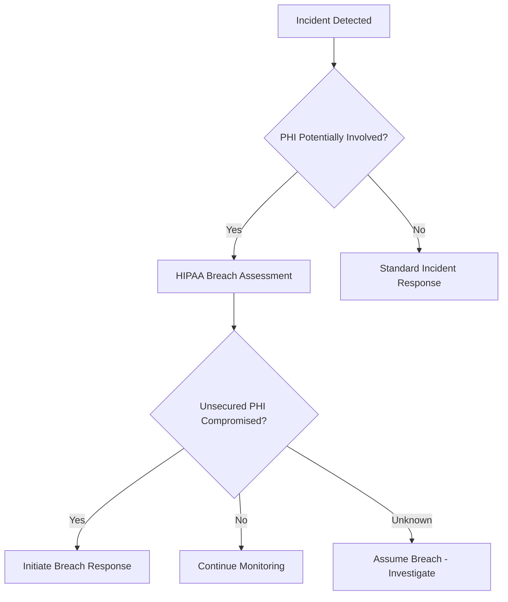

# 🚨 SECURITY INCIDENT RESPONSE PLAN
**Ignite Health Systems - Healthcare Security Emergency Response**

**Plan Version:** 2.0
**Effective Date:** September 24, 2025
**Last Updated:** September 24, 2025
**Next Review:** December 24, 2025

---

## 🎯 EXECUTIVE SUMMARY

This Security Incident Response Plan (SIRP) provides comprehensive procedures for detecting, containing, and responding to cybersecurity incidents affecting Ignite Health Systems' healthcare technology platform. Given our handling of Protected Health Information (PHI) and critical healthcare services, this plan prioritizes:

- **Patient Safety**: Ensuring continuity of care during incidents
- **PHI Protection**: Preventing unauthorized disclosure of health information
- **Regulatory Compliance**: Meeting HIPAA breach notification requirements
- **Business Continuity**: Maintaining essential healthcare services

---

## 📊 INCIDENT CLASSIFICATION MATRIX

### Severity Levels

| Level | Classification | Response Time | PHI Risk | Business Impact | Examples |
|-------|---------------|---------------|----------|-----------------|----------|
| **P1** | **CRITICAL** | < 15 minutes | High | Complete service outage | Ransomware, PHI breach, system compromise |
| **P2** | **HIGH** | < 30 minutes | Medium | Major functionality impacted | Authentication bypass, data corruption |
| **P3** | **MEDIUM** | < 2 hours | Low | Limited functionality impacted | DDoS, performance degradation |
| **P4** | **LOW** | < 24 hours | Minimal | Minor issues | Failed login attempts, minor vulnerabilities |

### Incident Categories

#### 1. **Data Breaches (HIPAA Reportable)**
- Unauthorized PHI access, use, or disclosure
- Lost or stolen devices containing PHI
- Misdirected PHI communications
- Database compromises with patient data

#### 2. **System Compromises**
- Malware/ransomware infections
- Unauthorized system access
- Privilege escalation attacks
- Remote access breaches

#### 3. **Service Disruptions**
- DDoS attacks affecting patient care
- System outages impacting clinical workflows
- Network connectivity issues
- Database corruption/failure

#### 4. **Social Engineering**
- Phishing attacks targeting healthcare staff
- Pretexting for PHI access
- Business email compromise (BEC)
- Vishing/smishing attempts

---

## 🚀 INCIDENT RESPONSE TEAM (IRT)

### Core Team Structure

#### **Incident Commander (IC)**
- **Primary**: Chief Technology Officer
- **Backup**: Security Lead
- **Responsibilities**: Overall incident coordination, decision-making authority

#### **Security Lead**
- **Primary**: HIPAA Security Officer
- **Backup**: Senior Security Analyst
- **Responsibilities**: Technical analysis, forensics, threat assessment

#### **Healthcare Compliance Officer**
- **Primary**: Privacy Officer
- **Backup**: Compliance Manager
- **Responsibilities**: HIPAA breach assessment, regulatory notifications

#### **Communications Lead**
- **Primary**: Marketing Director
- **Backup**: Customer Success Manager
- **Responsibilities**: Internal/external communications, media relations

#### **Legal Counsel**
- **Primary**: Healthcare Attorney
- **Backup**: General Counsel
- **Responsibilities**: Legal implications, law enforcement coordination

#### **Technical Lead**
- **Primary**: Lead DevOps Engineer
- **Backup**: Senior Developer
- **Responsibilities**: System restoration, technical mitigation

### Escalation Contacts

```yaml
Emergency Hotline: +1-555-SECURITY (24/7)
Incident Commander: Dr. Bhaven Murji - +1-555-0100
Security Lead: [Name] - +1-555-0101
Compliance Officer: [Name] - +1-555-0102
Legal Counsel: [Firm] - +1-555-0103

External Contacts:
FBI Cyber Division: +1-855-292-3937
HHS OCR Breach Report: https://ocrportal.hhs.gov
State Attorney General: [Varies by state]
Cyber Insurance: [Policy Number] - +1-555-0200
```

---

## ⏰ INCIDENT RESPONSE PHASES

### PHASE 1: DETECTION & ANALYSIS (0-30 minutes)

#### Detection Sources
- **Automated Security Alerts**: SIEM, IDS/IPS, antivirus
- **User Reports**: Staff reporting suspicious activity
- **Third-Party Notifications**: Vendors, law enforcement, researchers
- **Audit Log Analysis**: Unusual access patterns or behaviors

#### Initial Analysis Steps

```yaml
Immediate Actions (0-15 minutes):
1. Alert triage and severity assessment
2. Incident Commander notification
3. Preserve evidence and logs
4. Initial containment if obvious threat
5. Activate IRT based on severity

Analysis Tasks (15-30 minutes):
1. Confirm incident validity
2. Classify incident type and severity
3. Assess PHI involvement and scope
4. Determine affected systems/users
5. Estimate business impact
6. Document initial findings
```

#### Decision Tree for PHI Involvement



### PHASE 2: CONTAINMENT (30 minutes - 2 hours)

#### Short-term Containment (30-60 minutes)

```yaml
Network Isolation:
- Isolate affected systems from network
- Block suspicious IP addresses
- Disable compromised user accounts
- Implement emergency firewall rules

System Protection:
- Take forensic snapshots before changes
- Preserve memory dumps if possible
- Backup affected databases (encrypted)
- Document all containment actions

Communication:
- Brief IRT on containment status
- Notify affected departments
- Prepare preliminary assessment for leadership
- Coordinate with external security vendors
```

#### Long-term Containment (1-2 hours)

```yaml
Infrastructure Hardening:
- Patch identified vulnerabilities
- Strengthen authentication requirements
- Implement additional monitoring
- Deploy temporary security controls

Evidence Preservation:
- Secure chain of custody documentation
- Create forensic images of affected systems
- Collect network traffic captures
- Preserve email/communication records

Stakeholder Notification:
- Executive leadership briefing
- Board notification for critical incidents
- Initial customer/partner communication
- Regulatory body preliminary notification
```

### PHASE 3: ERADICATION & RECOVERY (2-24 hours)

#### Threat Elimination

```yaml
Malware Removal:
- Run comprehensive antivirus scans
- Remove malicious files and processes
- Clean infected systems thoroughly
- Validate system integrity

Vulnerability Patching:
- Apply security patches to affected systems
- Update security configurations
- Strengthen access controls
- Review and update security policies

Infrastructure Rebuild:
- Rebuild compromised systems from clean backups
- Validate backup integrity before restoration
- Implement enhanced security measures
- Test system functionality
```

#### System Recovery

```yaml
Phased Restoration:
Phase 1: Critical healthcare systems (0-4 hours)
Phase 2: Administrative systems (4-8 hours)
Phase 3: Secondary systems (8-24 hours)

Validation Testing:
- Security control verification
- Data integrity checks
- Performance testing
- User acceptance testing

Monitoring Enhancement:
- Implement additional logging
- Deploy enhanced threat detection
- Increase security monitoring frequency
- Setup incident-specific alerts
```

### PHASE 4: POST-INCIDENT ACTIVITY (24 hours - 30 days)

#### Immediate Post-Incident (24-72 hours)

```yaml
Documentation Completion:
- Finalize incident timeline
- Complete forensic analysis
- Document lessons learned
- Prepare executive summary

Regulatory Compliance:
- Complete HIPAA breach risk assessment
- Submit required regulatory notifications
- Prepare individual notification letters
- File with state authorities if required

Stakeholder Communication:
- Customer/patient notification
- Partner/vendor briefings
- Staff debriefing sessions
- Media response (if public)
```

#### Long-term Follow-up (1-30 days)

```yaml
Process Improvement:
- Conduct post-incident review meeting
- Update incident response procedures
- Revise security policies and controls
- Implement preventive measures

Training and Awareness:
- Conduct staff training on lessons learned
- Update security awareness programs
- Revise tabletop exercise scenarios
- Share intelligence with industry peers

Monitoring and Validation:
- Enhanced monitoring period (30 days)
- Regular security assessments
- Continuous improvement tracking
- Effectiveness measurement
```

---

## 📋 HIPAA BREACH NOTIFICATION PROCEDURES

### Breach Assessment Criteria

A breach of unsecured PHI is presumed unless the covered entity demonstrates:

1. **Low Probability of Compromise**: Risk assessment shows minimal likelihood of PHI being accessed, acquired, used, or disclosed
2. **Risk Factors Considered**:
   - Nature and extent of PHI involved
   - Unauthorized person who used PHI or to whom disclosure was made
   - Whether PHI was actually acquired or viewed
   - Extent to which risk has been mitigated

### 60-Day Notification Timeline

```yaml
Discovery to Individual Notification: 60 days maximum
- Individual notices: Written notification to affected individuals
- Substitute notice: If contact information insufficient
- Media notice: If breach affects 500+ residents of state/jurisdiction

Discovery to HHS Notification: 60 days maximum
- Submit breach report to HHS Office for Civil Rights
- Include all required elements per 45 CFR §164.408
- Provide annual summary for <500 individual breaches

Business Associate to Covered Entity: Without unreasonable delay
- Immediate notification of discovery
- Detailed investigation report
- Remediation steps taken
```

### Notification Templates

#### Individual Breach Notification
```
Subject: Important Notice About Your Health Information

Dear [Patient Name],

We are writing to inform you of an incident that may have involved some of your protected health information (PHI) at Ignite Health Systems.

WHAT HAPPENED:
On [Date], we discovered [brief description of incident]. We immediately took action to investigate and secure our systems.

INFORMATION INVOLVED:
The following types of information may have been involved:
• [List specific data types]

WHAT WE ARE DOING:
• [Specific remediation steps]
• [Security enhancements implemented]
• [Law enforcement cooperation if applicable]

WHAT YOU CAN DO:
• [Specific recommendations for the individual]
• Monitor your healthcare statements for unusual activity
• Contact us with any questions or concerns

We sincerely apologize for this incident and any inconvenience it may cause. Protecting your health information is a top priority.

If you have questions, please contact us at:
Phone: [Number]
Email: [Email]
Address: [Mailing Address]

Sincerely,
[Name and Title]
Ignite Health Systems
```

---

## 🔧 TECHNICAL RESPONSE PROCEDURES

### Evidence Collection Checklist

```yaml
Digital Evidence:
□ System memory dumps
□ Hard drive forensic images
□ Network packet captures
□ Log files (system, security, application)
□ Database transaction logs
□ Email communications
□ Cloud service logs

Physical Evidence:
□ Affected hardware devices
□ Network equipment configurations
□ Physical access logs
□ Security camera footage
□ Written documentation

Chain of Custody:
□ Evidence collection forms completed
□ Secure storage implemented
□ Access control maintained
□ Transfer documentation
```

### Forensic Analysis Tools

```yaml
Network Analysis:
- Wireshark for packet analysis
- NetworkMiner for network forensics
- Volatility for memory analysis

System Analysis:
- SANS SIFT Workstation
- Autopsy digital forensics platform
- FTK Imager for disk imaging

Malware Analysis:
- VirusTotal for threat intelligence
- Hybrid Analysis for dynamic analysis
- REMnux for malware reverse engineering

Cloud Forensics:
- AWS CloudTrail analysis
- Azure Security Center
- Google Cloud Security Command Center
```

### System Hardening Post-Incident

```yaml
Immediate Hardening (0-24 hours):
□ Change all administrative passwords
□ Revoke and reissue API keys
□ Update firewall rules
□ Enable additional logging
□ Implement network segmentation
□ Deploy additional monitoring tools

Medium-term Hardening (1-7 days):
□ Conduct vulnerability assessment
□ Apply all security patches
□ Review and update access controls
□ Implement multi-factor authentication
□ Update security policies
□ Conduct penetration testing

Long-term Hardening (1-4 weeks):
□ Implement zero-trust architecture
□ Deploy advanced threat protection
□ Enhance security monitoring
□ Conduct security awareness training
□ Update disaster recovery plans
□ Review third-party security
```

---

## 🗣️ COMMUNICATION STRATEGIES

### Internal Communication Matrix

| Audience | Notification Time | Method | Content Level |
|----------|------------------|--------|---------------|
| **IRT Members** | Immediate | Phone/SMS/Slack | Full technical details |
| **Executive Leadership** | <15 minutes | Phone/Email | Executive summary |
| **All Staff** | <2 hours | Email/Meeting | Basic awareness |
| **Board of Directors** | <4 hours | Email/Call | Strategic implications |
| **IT Department** | <15 minutes | Direct/Slack | Technical details |

### External Communication Guidelines

#### Media Response
- **Designated Spokesperson**: Chief Executive Officer
- **Backup Spokesperson**: Chief Technology Officer
- **Message Consistency**: All statements pre-approved by legal counsel
- **Transparency Balance**: Honest without compromising investigation

#### Customer/Patient Communication
- **Timing**: As required by law, but prioritize transparency
- **Channels**: Email, website notice, direct mail, phone calls
- **Content**: Clear, non-technical language explaining impact and remediation
- **Support**: Dedicated helpline for questions and concerns

#### Regulatory Communication
- **HHS Office for Civil Rights**: Formal breach notification
- **State Attorneys General**: As required by state law
- **FBI/Secret Service**: For significant cybercrimes
- **Industry Partners**: Threat intelligence sharing

---

## 📈 METRICS AND REPORTING

### Key Performance Indicators (KPIs)

```yaml
Response Time Metrics:
- Time to detection: Target <30 minutes
- Time to containment: Target <2 hours
- Time to eradication: Target <24 hours
- Time to recovery: Target <48 hours

Effectiveness Metrics:
- False positive rate: Target <5%
- Incident recurrence rate: Target <2%
- Staff response time: Target <15 minutes
- Stakeholder notification time: Target <4 hours

Business Impact Metrics:
- System downtime duration
- Number of patients affected
- Financial impact assessment
- Reputation impact measurement
```

### Incident Reporting Dashboard

```yaml
Real-time Metrics:
- Active incidents by severity
- Response team availability
- System status indicators
- Recent threat intelligence

Historical Analysis:
- Incident trends over time
- Attack vector analysis
- Response effectiveness
- Cost per incident

Compliance Tracking:
- HIPAA notification compliance
- Regulatory reporting status
- Audit trail completeness
- Training completion rates
```

---

## 🎓 TRAINING AND PREPAREDNESS

### Regular Training Requirements

```yaml
All Staff (Quarterly):
- Security awareness basics
- Incident recognition and reporting
- Phishing identification
- Physical security practices

IRT Members (Monthly):
- Technical response procedures
- New threat intelligence
- Tool training and updates
- Communication protocols

Leadership (Semi-annually):
- Crisis management
- Media relations
- Legal and regulatory requirements
- Business continuity planning
```

### Tabletop Exercises

```yaml
Scenario-based Exercises (Quarterly):
- PHI data breach simulation
- Ransomware attack response
- Insider threat investigation
- Third-party vendor compromise

Full-scale Drills (Annually):
- Complete IRT activation
- External communication testing
- System recovery procedures
- Regulatory notification process

After-action Reviews:
- Exercise effectiveness assessment
- Process improvement identification
- Training gap analysis
- Plan updates and revisions
```

---

## 📞 EMERGENCY CONTACT DIRECTORY

### Internal Emergency Contacts

| Role | Primary | Backup | Phone | Email |
|------|---------|--------|-------|-------|
| Incident Commander | Dr. Bhaven Murji | [Backup] | +1-555-0100 | bhaven@ignitehealthsystems.com |
| Security Lead | [Name] | [Backup] | +1-555-0101 | security@ignitehealthsystems.com |
| Privacy Officer | [Name] | [Backup] | +1-555-0102 | privacy@ignitehealthsystems.com |
| Legal Counsel | [Firm] | [Backup] | +1-555-0103 | legal@ignitehealthsystems.com |
| Communications | [Name] | [Backup] | +1-555-0104 | pr@ignitehealthsystems.com |

### External Emergency Contacts

| Organization | Contact | Phone | Website/Portal |
|--------------|---------|-------|----------------|
| **FBI Cyber Division** | Internet Crime Complaint Center | +1-855-292-3937 | https://ic3.gov |
| **HHS OCR** | Breach Reporting | +1-800-368-1019 | https://ocrportal.hhs.gov |
| **State AG (General)** | Varies by state | Varies | Attorney General websites |
| **Cyber Insurance** | [Insurer] | +1-555-0200 | Policy portal |
| **Security Vendor** | [Vendor] | +1-555-0300 | Support portal |

---

## 🔄 CONTINUOUS IMPROVEMENT

### Plan Maintenance Schedule

```yaml
Monthly Reviews:
- Contact information updates
- Procedure refinements
- New threat integration
- Tool and resource updates

Quarterly Updates:
- Full plan review
- Regulatory requirement changes
- Industry best practice adoption
- Training program updates

Annual Overhaul:
- Complete plan rewrite
- Stakeholder feedback integration
- Legal and compliance review
- Executive approval and sign-off
```

### Lessons Learned Integration

```yaml
Post-Incident Reviews:
- Root cause analysis
- Response effectiveness evaluation
- Process gap identification
- Resource adequacy assessment

Industry Intelligence:
- Threat landscape monitoring
- Peer incident analysis
- Regulatory guidance updates
- Best practice evolution

Continuous Testing:
- Monthly security assessments
- Quarterly penetration testing
- Annual red team exercises
- Ongoing vulnerability scanning
```

---

**Document Control**: This Security Incident Response Plan is reviewed monthly and updated quarterly to ensure effectiveness and compliance with current regulations and industry best practices.

**Approval**: This plan has been reviewed and approved by the HIPAA Security Officer, Legal Counsel, and Executive Leadership.

**Distribution**: This plan is distributed to all IRT members, executive leadership, and key stakeholders with appropriate confidentiality controls.