# 🔄 IGNITE HEALTH SYSTEMS - WORKFLOW AUTOMATION DIAGRAMS

## 📊 SYSTEM ARCHITECTURE OVERVIEW

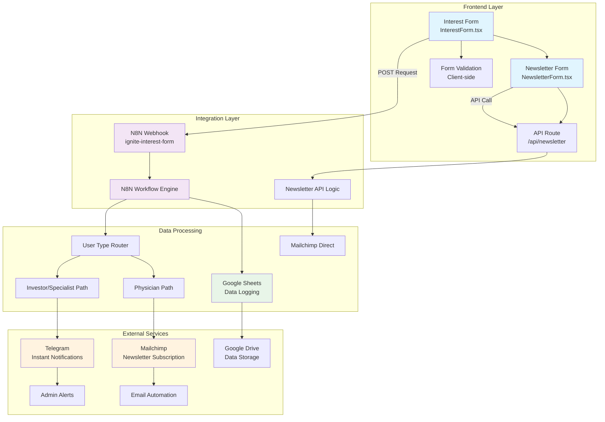

## 🎯 INTEREST FORM WORKFLOW

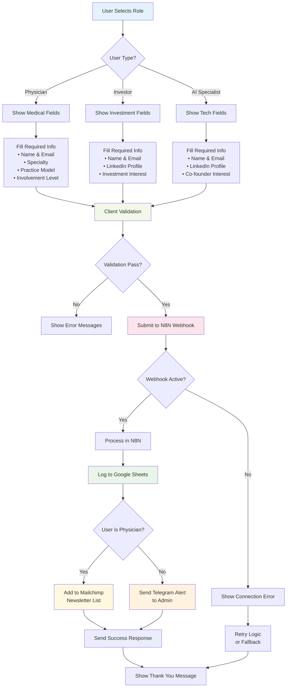

## 📧 NEWSLETTER SUBSCRIPTION WORKFLOW

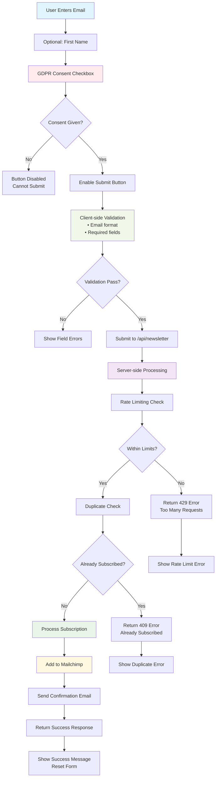

## 🔄 MONTHLY ARTICLE GENERATION WORKFLOW

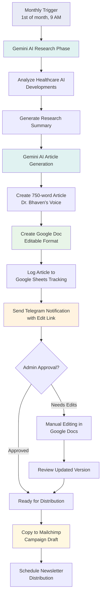

## ⚠️ ERROR HANDLING & RECOVERY FLOWS

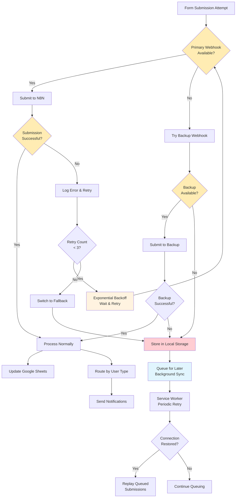

## 🔄 N8N INTERNAL WORKFLOW STRUCTURE

### Interest Form Handler Workflow
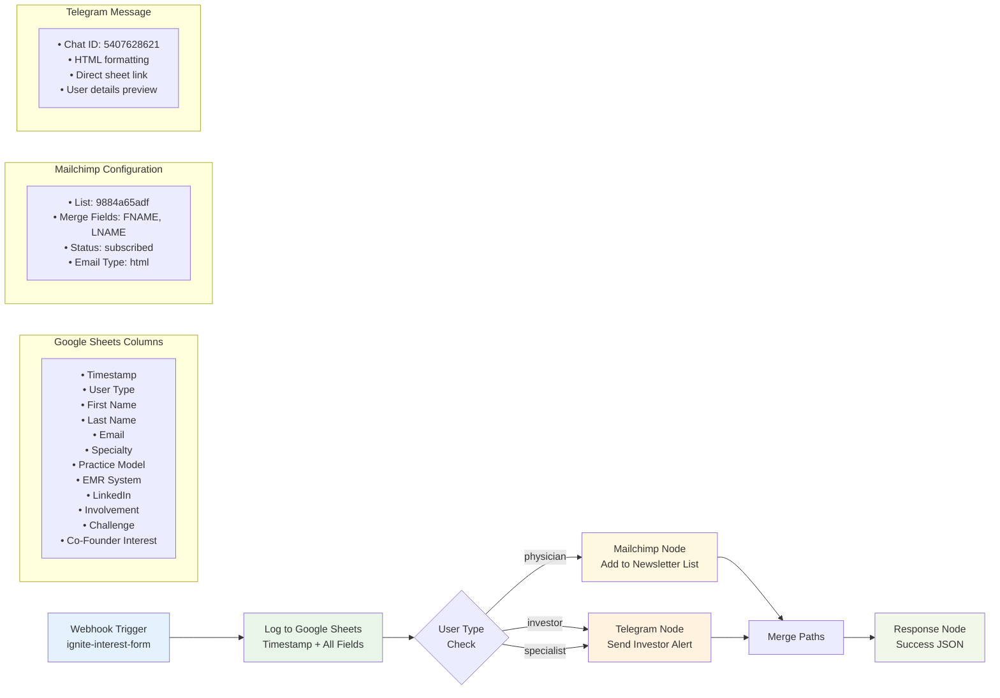

### Monthly Article Generation Workflow
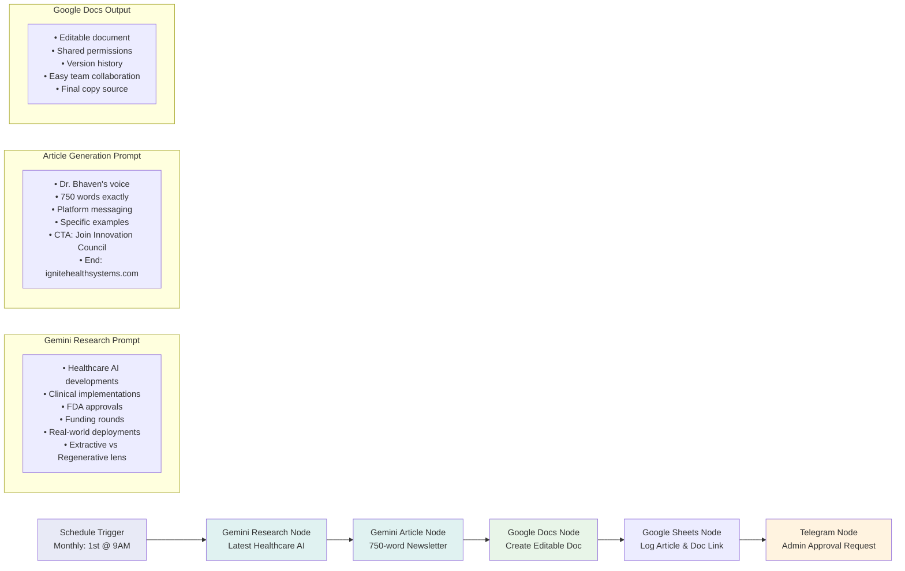

## 📊 DATA FLOW ARCHITECTURE

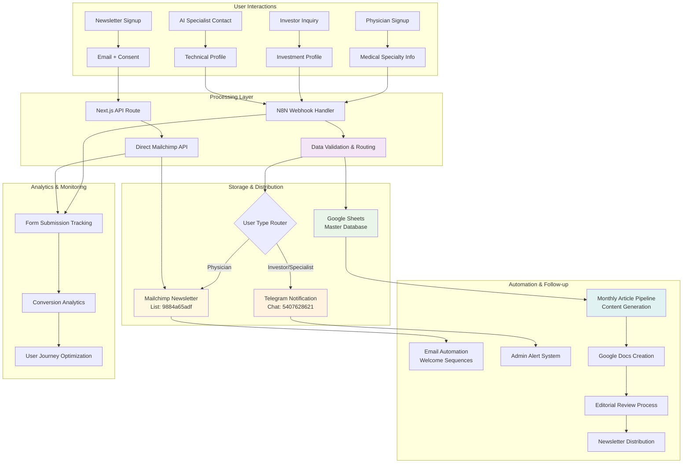

## 🚨 FAILURE MODES & RECOVERY

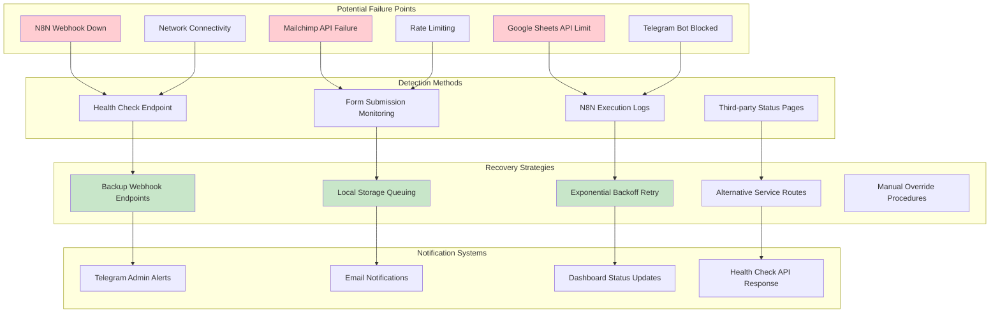

## 📈 PERFORMANCE & SCALING CONSIDERATIONS

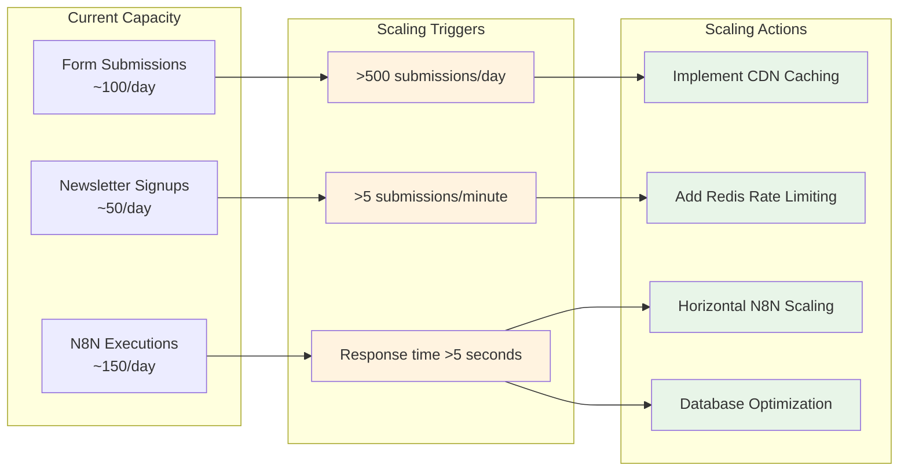

## 🔧 MAINTENANCE & MONITORING WORKFLOWS

```mermaid
graph TB
    subgraph "Daily Monitoring"
        A1[Health Check Automation<br/>Every 5 minutes]
        A2[Form Submission Analytics<br/>Daily reports]
        A3[Error Rate Monitoring<br/>Alert threshold: 5%]
    end

    subgraph "Weekly Maintenance"
        B1[N8N Workflow Review<br/>Execution success rates]
        B2[API Credential Validation<br/>Expiry checks]
        B3[Google Sheets Data Cleanup<br/>Remove test entries]
    end

    subgraph "Monthly Operations"
        C1[Performance Optimization<br/>Response time analysis]
        C2[Integration Health Audit<br/>All third-party services]
        C3[Backup & Recovery Testing<br/>Disaster recovery drills]
    end

    A1 --> D1[Telegram Alerts]
    A2 --> D2[Analytics Dashboard]
    A3 --> D1

    B1 --> E1[Workflow Optimizations]
    B2 --> E2[Credential Renewals]
    B3 --> E3[Data Integrity Maintenance]

    C1 --> F1[Infrastructure Scaling]
    C2 --> F2[Service Level Agreements]
    C3 --> F3[Business Continuity Planning]

    style A1 fill:#e3f2fd
    style B1 fill:#f3e5f5
    style C1 fill:#e0f2f1
```

These workflow diagrams provide a comprehensive visual representation of the Ignite Health Systems automation architecture, covering both normal operations and failure scenarios. They serve as documentation for troubleshooting, optimization, and future development.