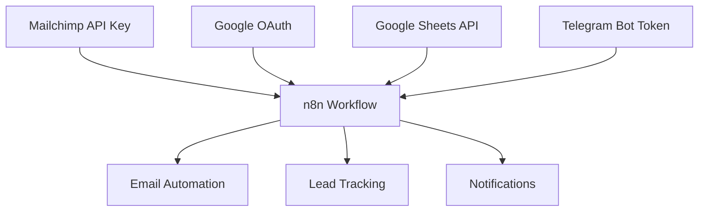

# Secrets Management Strategy
## Ignite Health Systems - Production Deployment Security

### Overview

This document outlines the comprehensive secrets management strategy for the Mailchimp automation deployment, ensuring secure handling of sensitive credentials and API keys across all environments.

## 🔐 Security Principles

### Core Security Standards
- **Zero Trust Architecture**: Never trust, always verify
- **Principle of Least Privilege**: Minimal access rights
- **Defense in Depth**: Multiple security layers
- **Rotation by Default**: Regular credential rotation
- **Audit Everything**: Complete access logging

### Compliance Requirements
- **GDPR Compliance**: European data protection
- **HIPAA Considerations**: Healthcare data privacy
- **SOC 2 Alignment**: Security control frameworks
- **PCI DSS**: Payment card industry standards

## 🏗️ Architecture Overview

### Secret Categories

#### 1. API Credentials
- **Mailchimp API Keys**: Marketing automation access
- **n8n API Keys**: Workflow automation access
- **Google API Keys**: Sheets, OAuth, Drive access
- **Telegram Bot Tokens**: Notification services
- **Cloudflare API Tokens**: DNS and CDN management

#### 2. Database Credentials
- **PostgreSQL**: Primary database access
- **Redis**: Caching and session storage
- **MongoDB**: Document storage (if applicable)

#### 3. OAuth Tokens
- **Google OAuth**: Multiple service access
- **Mailchimp OAuth**: Extended API access
- **GitHub OAuth**: Repository access

#### 4. Encryption Keys
- **Application Secrets**: JWT signing, session encryption
- **Database Encryption**: At-rest data protection
- **Transport Encryption**: TLS certificates

#### 5. Third-Party Services
- **Sentry DSN**: Error tracking
- **Analytics Keys**: Usage monitoring
- **CDN Secrets**: Asset delivery

## 🛠️ Implementation Strategy

### Environment-Based Secret Management

#### Development Environment
```bash
# Local development - use .env.local
# Never commit actual secrets to version control

# Example .env.local structure
MAILCHIMP_API_KEY=development_key_here
N8N_API_KEY=development_key_here
GOOGLE_SHEETS_API_KEY=development_key_here
```

#### Staging Environment
```bash
# Staging - use limited scope credentials
# Separate from production with read-only where possible

MAILCHIMP_API_KEY=staging_limited_key
N8N_API_KEY=staging_workflow_key
GOOGLE_SHEETS_API_KEY=staging_sheets_key
```

#### Production Environment
```bash
# Production - full access credentials
# Managed through secure deployment pipeline

MAILCHIMP_API_KEY=production_full_access_key
N8N_API_KEY=production_automation_key
GOOGLE_SHEETS_API_KEY=production_sheets_key
```

### Secret Storage Solutions

#### 1. Environment Variables (Current)
**Pros:**
- Simple implementation
- Widely supported
- Easy deployment integration

**Cons:**
- Visible in process lists
- Limited rotation capabilities
- No audit trail

**Security Measures:**
- Never log environment variables
- Use secure deployment pipelines
- Regular rotation schedules

#### 2. Cloud Secret Managers (Recommended)
**AWS Secrets Manager:**
```json
{
  "name": "ignite-health/mailchimp-api-key",
  "description": "Mailchimp API key for production automation",
  "secretString": "697c6283b195ac0a1e2e4a6d05ee590c-us18",
  "versionStage": "AWSCURRENT",
  "rotation": {
    "enabled": true,
    "frequency": "30 days"
  }
}
```

**Google Secret Manager:**
```yaml
name: projects/ignite-health/secrets/mailchimp-api-key
replication:
  automatic: {}
labels:
  environment: production
  service: email-automation
  rotation: enabled
```

**Azure Key Vault:**
```json
{
  "name": "ignite-mailchimp-key",
  "value": "697c6283b195ac0a1e2e4a6d05ee590c-us18",
  "contentType": "text/plain",
  "attributes": {
    "enabled": true,
    "exp": 1672531200,
    "nbf": 1641081600
  }
}
```

#### 3. HashiCorp Vault (Advanced)
```hcl
# Vault configuration for advanced secret management
secret "kv/ignite-health/production" {
  mailchimp_api_key = "697c6283b195ac0a1e2e4a6d05ee590c-us18"
  n8n_api_key = "secure_n8n_key_here"
  google_sheets_api_key = "secure_google_key_here"
}

# Policy for secret access
path "kv/ignite-health/production/*" {
  capabilities = ["read"]
}
```

## 🔄 Secret Rotation Strategy

### Automated Rotation Schedule

#### High-Risk Secrets (Weekly)
- Database passwords
- OAuth refresh tokens
- Session encryption keys

#### Medium-Risk Secrets (Monthly)
- API keys (Mailchimp, n8n)
- Service tokens
- Webhook secrets

#### Low-Risk Secrets (Quarterly)
- TLS certificates
- Static API keys
- Non-critical service credentials

### Rotation Implementation

#### Pre-Rotation Checklist
- [ ] Verify new secret generation
- [ ] Test new secret functionality
- [ ] Update dependent services
- [ ] Schedule maintenance window

#### Rotation Process
```bash
#!/bin/bash
# Example rotation script for Mailchimp API key

# 1. Generate new API key (manual Mailchimp process)
NEW_API_KEY="new_key_from_mailchimp"

# 2. Test new key functionality
curl -X GET \
  -H "Authorization: Basic $(echo -n "anystring:$NEW_API_KEY" | base64)" \
  "https://us18.api.mailchimp.com/3.0/ping"

# 3. Update environment variables
export MAILCHIMP_API_KEY_NEW="$NEW_API_KEY"

# 4. Update applications with zero downtime
kubectl set env deployment/n8n-automation MAILCHIMP_API_KEY="$NEW_API_KEY"

# 5. Verify deployment health
kubectl rollout status deployment/n8n-automation

# 6. Revoke old API key (manual Mailchimp process)
echo "Manual step: Revoke old API key in Mailchimp dashboard"

# 7. Update documentation
echo "$(date): Rotated Mailchimp API key" >> /var/log/secret-rotation.log
```

#### Post-Rotation Verification
- [ ] All services using new secrets
- [ ] Old secrets revoked
- [ ] No service disruptions
- [ ] Audit logs updated

## 🛡️ Access Control

### Role-Based Access Control (RBAC)

#### Roles and Permissions

**Developer Role:**
- Read access to development secrets
- No access to production secrets
- Can create test credentials

**DevOps Engineer Role:**
- Read/write access to staging secrets
- Read access to production secrets
- Can rotate non-critical secrets

**Security Administrator Role:**
- Full access to all secrets
- Can create/delete secrets
- Manages access policies

**Production Deployer Role:**
- Read access to production secrets
- Can update secrets during deployment
- Limited to automation context

### Service Account Management

#### n8n Service Account
```json
{
  "name": "n8n-automation-service",
  "permissions": [
    "mailchimp:api:read",
    "mailchimp:api:write",
    "google:sheets:read",
    "google:sheets:write",
    "telegram:bot:send"
  ],
  "restrictions": {
    "ip_whitelist": ["10.0.0.0/8"],
    "time_window": "business_hours",
    "rate_limit": "1000/hour"
  }
}
```

#### Deployment Service Account
```json
{
  "name": "deployment-automation",
  "permissions": [
    "secrets:read",
    "secrets:rotate",
    "monitoring:write"
  ],
  "restrictions": {
    "source_ips": ["CI/CD_server_ips"],
    "mfa_required": true
  }
}
```

## 📊 Monitoring and Auditing

### Secret Usage Monitoring

#### Metrics to Track
- Secret access frequency
- Failed authentication attempts
- Unusual access patterns
- Geographic access anomalies
- Time-based access violations

#### Alerting Thresholds
```yaml
alerts:
  - name: "High frequency secret access"
    condition: "secret_access_rate > 100/minute"
    severity: "warning"

  - name: "Failed authentication spike"
    condition: "auth_failures > 10/5minutes"
    severity: "critical"

  - name: "Geographic anomaly"
    condition: "access_from_new_country = true"
    severity: "warning"

  - name: "After-hours access"
    condition: "access_time outside business_hours"
    severity: "info"
```

### Audit Logging

#### Log Structure
```json
{
  "timestamp": "2025-01-15T10:30:00Z",
  "event_type": "secret_access",
  "secret_name": "mailchimp-api-key",
  "user_id": "deployment-automation",
  "source_ip": "10.0.1.50",
  "action": "read",
  "success": true,
  "metadata": {
    "deployment_id": "deploy-2025-0115-103000",
    "environment": "production"
  }
}
```

#### Retention Policy
- **High-sensitivity logs**: 7 years
- **Medium-sensitivity logs**: 3 years
- **Operational logs**: 1 year
- **Debug logs**: 90 days

## 🚨 Incident Response

### Secret Compromise Response

#### Immediate Actions (0-15 minutes)
1. **Revoke compromised secret immediately**
2. **Generate new secret**
3. **Update all dependent services**
4. **Notify security team**
5. **Begin incident tracking**

#### Short-term Actions (15 minutes - 2 hours)
1. **Analyze access logs for extent of compromise**
2. **Update all related secrets as precaution**
3. **Implement additional monitoring**
4. **Notify stakeholders**
5. **Document incident timeline**

#### Long-term Actions (2+ hours)
1. **Conduct full security review**
2. **Update security procedures**
3. **Implement additional controls**
4. **Staff security training**
5. **Compliance reporting**

### Recovery Procedures

#### Service Recovery Checklist
- [ ] All secrets rotated
- [ ] Services operational
- [ ] Monitoring restored
- [ ] Audit trail complete
- [ ] Stakeholders informed

#### Post-Incident Review
- **What happened?** - Root cause analysis
- **How was it detected?** - Detection effectiveness
- **What was the impact?** - Business impact assessment
- **How can we prevent it?** - Process improvements

## 🔧 Implementation Guide

### Phase 1: Current State Assessment (Week 1)
1. **Inventory all current secrets**
2. **Assess current security posture**
3. **Identify high-risk credentials**
4. **Document current access patterns**

### Phase 2: Security Hardening (Week 2)
1. **Implement environment isolation**
2. **Add secret rotation capabilities**
3. **Enhance monitoring and alerting**
4. **Update access controls**

### Phase 3: Advanced Secret Management (Week 3-4)
1. **Migrate to cloud secret manager**
2. **Implement automated rotation**
3. **Add comprehensive auditing**
4. **Conduct security testing**

### Phase 4: Operationalization (Week 5-6)
1. **Train operations team**
2. **Document procedures**
3. **Establish monitoring dashboards**
4. **Conduct tabletop exercises**

## 📋 Secret Inventory

### Current Production Secrets

#### Mailchimp
- **API Key**: `697c6283b195ac0a1e2e4a6d05ee590c-us18`
- **Audience ID**: `9884a65adf`
- **Server**: `us18`
- **Webhook Secret**: `<to_be_generated>`

#### n8n
- **API Key**: `<configured_in_n8n>`
- **Base URL**: `https://bhavenmurji.app.n8n.cloud`
- **Encryption Key**: `<n8n_generated>`

#### Google Services
- **Sheets API Key**: `<google_api_key>`
- **OAuth Client ID**: `<google_oauth_client_id>`
- **OAuth Client Secret**: `<google_oauth_client_secret>`
- **Sheets ID**: `1kPYgthwKzREJYKjAnE4h1YFMRxg5ulynrbDYNRxb8Lo`

#### Telegram
- **Bot Token**: `<telegram_bot_token>`
- **Chat ID**: `5407628621`

### Secret Relationships



## 🎯 Success Metrics

### Security KPIs
- **Zero** secret compromises
- **100%** of secrets rotated on schedule
- **<1 minute** mean time to secret rotation
- **100%** audit coverage
- **<5 minutes** incident response time

### Operational KPIs
- **99.9%** service uptime during rotations
- **<30 seconds** deployment time impact
- **100%** automation of rotation process
- **Zero** manual intervention required

## 📚 Resources and References

### Documentation
- [Mailchimp API Security](https://mailchimp.com/developer/marketing/docs/security/)
- [Google Cloud Security Best Practices](https://cloud.google.com/security/best-practices)
- [n8n Security Guidelines](https://docs.n8n.io/hosting/security/)
- [OWASP Secret Management](https://owasp.org/www-community/vulnerabilities/Sensitive_Data_Exposure)

### Tools and Services
- **AWS Secrets Manager**: Enterprise secret storage
- **Google Secret Manager**: Cloud-native secret management
- **HashiCorp Vault**: Open-source secret management
- **Azure Key Vault**: Microsoft cloud secret storage

### Compliance Frameworks
- **NIST Cybersecurity Framework**: Security standards
- **ISO 27001**: Information security management
- **SOC 2**: Service organization controls
- **PCI DSS**: Payment card industry standards

---

**Document Version**: 1.0
**Last Updated**: January 15, 2025
**Next Review**: April 15, 2025
**Owner**: Dr. Bhaven Murji
**Reviewer**: Security Team